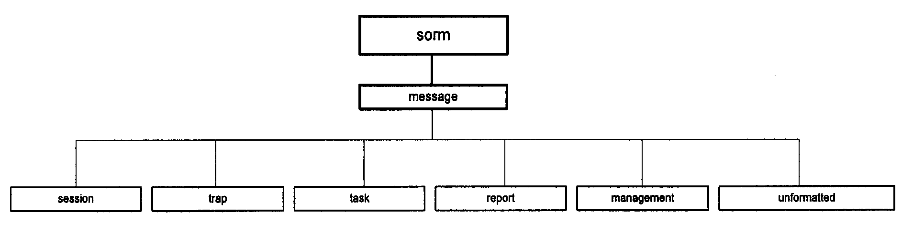
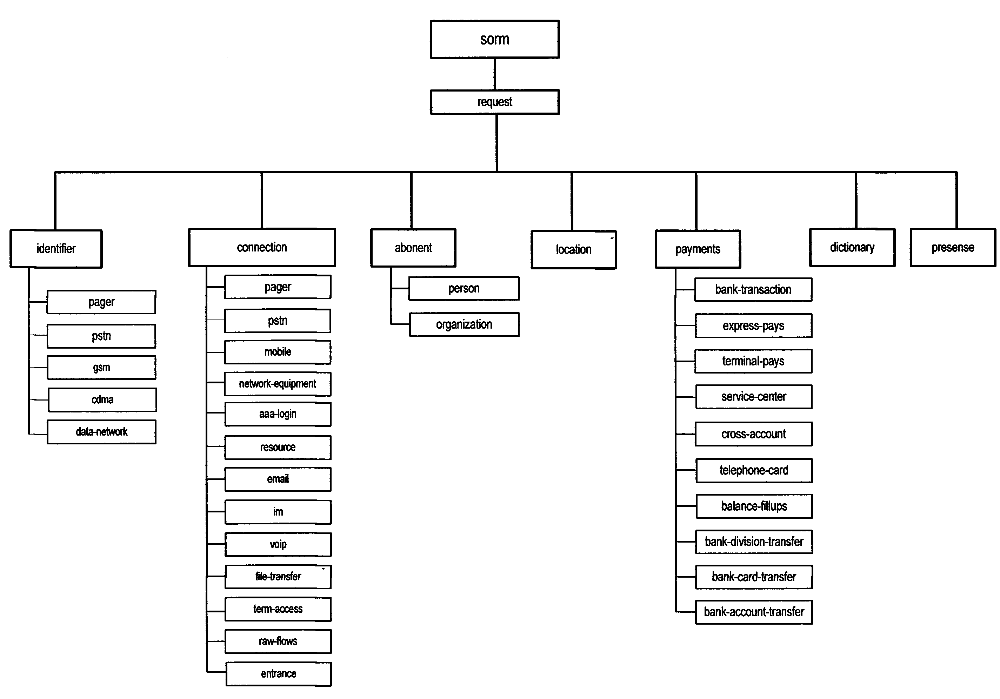
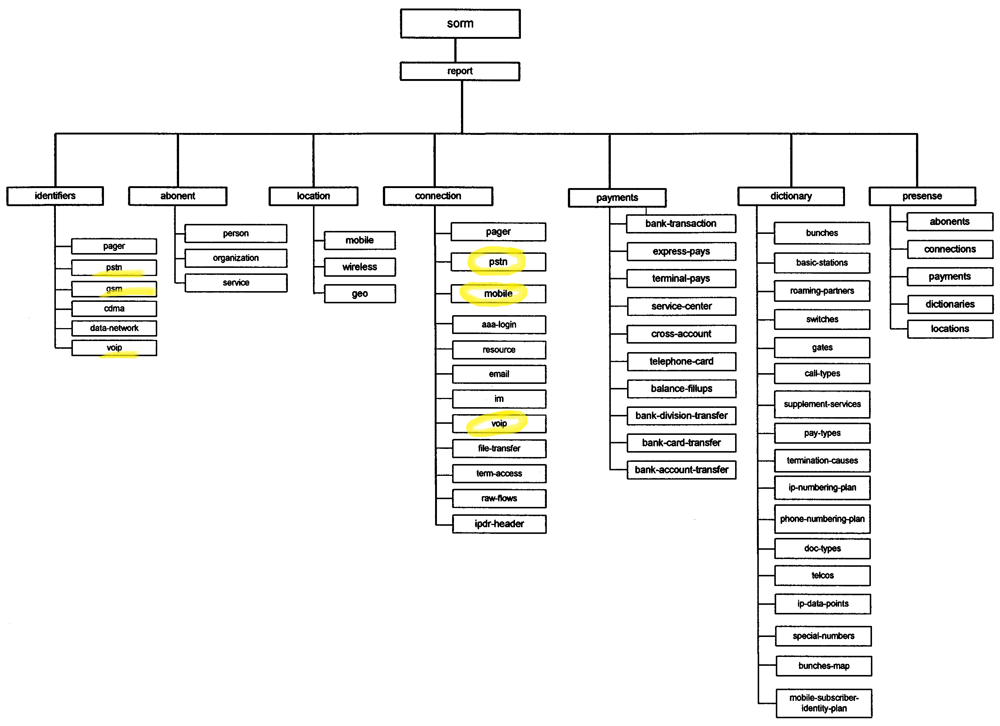
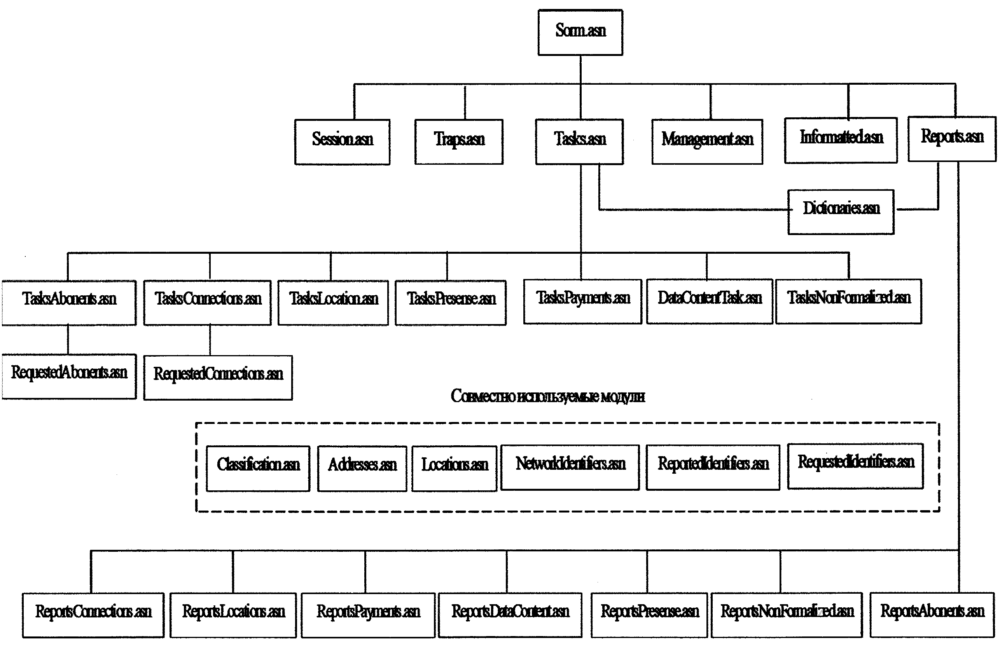

# sorm3

Приказ Минкомсвязи России от 29.10.2018 N 573 

Об утверждении Требований к техническим и программным средствам информационных систем, содержащих базы данных абонентов оператора связи и предоставленных им услугах связи, а также информацию о пользователях услугами связи и о предоставленных им услугах связи, обеспечивающих выполнение установленных действий при проведении оперативно-розыскных мероприятий 

(Зарегистрировано в Минюсте России 18.12.2018 N 53028)

- Содержимое приказа:
  <https://sudact.ru/law/prikaz-minkomsviazi-rossii-ot-29102018-n-573/>
- Содержимое приложения 9. 
  "Требования к параметрам кодирования протокола взаимодействия ASN.1 пункта управления и информационных систем, содержащих базы данных абонентов оператора связи и предоставленных им услугах связи, а также информацию о пользователях услугами связи и о предоставленных им услугах связи, обеспечивающих выполнение установленных действий при проведении оперативно-розыскных мероприятий" :
  <https://sudact.ru/law/prikaz-minkomsviazi-rossii-ot-29102018-n-573/prilozhenie/prilozhenie-n-9/>

## Анализ asn-файлов из приложения 9

В каталоге html приведена документация по asn-файлам полученная с помощью  [ASN1Doc](https://asn1.io/ASN1Doc/)

В качестве стартовой точки можно изучить файл [html/summary.html](html/summary.html) локально в рабочей копии
или на http://htmlpreview.github.io/?https://github.com/Sergey-Zorin/sorm3/blob/master/html/summary.html

Попробуем сопоставить asn-файлы из прил.9 со схемами из прил.8

### Схема 1

> 1. Структура модулей протокола взаимодействия ПУ и информационных систем, содержащих базы данных абонентов оператора связи и предоставленных им услугах связи, а также информацию о пользователях услугами связи и о предоставленных им услугах связи, обеспечивающих выполнение установленных действий при проведении оперативно-розыскных мероприятий (далее - ИС ОРМ) приведена на схеме 1.



В целом, схема соответствует содержимому файла [Sorm.asn](html/Sorm.asn.html) Прямоугольники на схеме соответствуют нескольким типам сообщений. Более подробно каждый тип описан в отдельном файле. 

:warning: тип filter не представлен на схеме и не описан ни в одном файле

| тип | описание | файл |
| ---- | ---- | ---- |
|  sessionMessage  |  сообщения организации сессии | [Sessions.asn](html/Sessions.asn.html) |
|  trapMessage    |  сообщения сигналов | [Traps.asn](html/Traps.asn.html) |
|  taskMessage    |  сообщения работы с задачами | [Tasks.asn](html/Tasks.asn.html) |
|  reportMessage  | сообщения работы с отчетами | [Reports.asn](html/Sorm.asn.html) |
|  managementMessage | сообщения канала передачи мониторинга (КПМ) | [Reports.asn](html/Sorm.asn.html) |
|  unformattedMessage | сообщения канала передачи неформатированных данных (КПНФ) | [Unformatted.asn](html/Unformatted.asn.html) |
|  filterMessage | сообщения установки/снятия фильтров записываемого содержимого соединений сети передачи данных | ??? |

Например,  в [Sessions.asn](html/Sessions.asn.html) описаны возможные запросы/ответы, и состав их полей:

```asn.1
sessionMessage   TAGGED ::= {
 OID {sorm-message-session} DATA CHOICE {
   connect              [0] ConnectRequest,     --- запрос на открытие сессии
   connect-response     [1] ConnectResponse,    --- ответ на запрос открытия сессии
   adjustment           [2] AdjustmentRequest,  --- согласование поддерживаемых типов со стороны ПУ
   adjustment-response  [3] AdjustmentResponse, --- ответ на запрос согласования данных
   disconnect           [4] DisconnectRequest,  --- запрос на закрытие сессии
   disconnect-response  [5] DisconnectResponse  --- ответ на запрос закрытия сессии
   }
}

--- запрос создания сессии
ConnectRequest ::=   SEQUENCE {
   session-timeout           INTEGER (60..2592000),   --- максимальное время неактивности
   max-data-length           INTEGER (10..100000),    --- максимальная длина блока отчета (в строках)
   data-packet-window-size   INTEGER (4..256),        --- окно канала передачи данных
...
}
...
```

В файле  [Classification.asn](html/Classification.asn.html) можно найти идентификаторы типов:
```
sorm-message-session     OID ::= "280"
sorm-message-trap        OID ::= "281"
sorm-message-task        OID ::= "282"
sorm-message-report      OID ::= "283"
sorm-message-management  OID ::= "284"
sorm-message-unformatted OID ::= "285"
sorm-message-filter      OID ::= "286"
```

### Схема 2

> 2. Структура разделения поисковых критериев кпд1 представлена на схеме 2.



В файле  [Classification.asn](html/Classification.asn.html) можно найти соответствующие идентификаторы:
```
sorm-request-identifier-pager OID ::= "140"
sorm-request-identifier-pstn OID ::= "141"
sorm-request-identifier-gsm OID ::= "142"
sorm-request-identifier-cdma OID ::= "143"
sorm-request-identifier-data-network OID ::= "144"
sorm-request-identifier-voip OID ::= "145"
sorm-request-connection-pager OID ::= "160"
sorm-request-connection-pstn OID ::= "161"
sorm-request-connection-mobile OID ::= "162"
sorm-request-connection-aaa-login OID ::= "164"
sorm-request-connection-resource OID ::= "165"
sorm-request-connection-email OID ::= "166"
sorm-request-connection-im OID ::= "167"
sorm-request-connection-voip OID ::= "168"
sorm-request-connection-file-transfer OID ::= "169"
sorm-request-connection-term-access OID ::= "170"
sorm-request-connection-raw-flows OID ::= "171"
sorm-request-connection-entrance OID ::= "172"
sorm-request-connection-address-translations OID ::= "173"
sorm-request-abonent-person OID ::= "180"
sorm-request-abonent-organization OID ::= "181"
sorm-request-location OID ::= "200"
sorm-request-payment-bank-transaction OID ::= "220"
sorm-request-payment-express-pays OID ::= "221"
sorm-request-payment-terminal-pays OID ::= "222"
sorm-request-payment-service-center OID ::= "223"
sorm-request-payment-cross-account OID ::= "224"
sorm-request-payment-telephone-card OID ::= "225"
sorm-request-payment-balance-fillups OID ::= "226"
sorm-request-payment-bank-division-transfer OID ::= "227"
sorm-request-payment-bank-card-transfer OID ::= "228"
sorm-request-payment-bank-account-transfer OID ::= "229"
sorm-request-dictionaries OID ::= "240"
sorm-request-presense OID ::= "260"
```

Наименования файлов идет как-то в разнобой (что настораживает)

| идентификаторы  | файл |
| ---- | ---- |
| sorm-request-identifier-*  | [RequestedIdentifiers.asn](html/RequestedIdentifiers.asn.html) |
| sorm-request-connection-*  | [RequestedConnections.asn](html/RequestedConnections.asn.html) |
| sorm-request-abonent-*  | [RequestedAbonents.asn](html/RequestedAbonents.asn.html) |
| sorm-request-location  | ???? |
| sorm-request-payment-*  | [TasksPayments.asn](html/TasksPayments.asn.html) |
| sorm-request-dictionaries  | [Dictionaries.asn](html/Dictionaries.asn.html) |
| sorm-request-presense  | [TasksPresense.asn](html/TasksPresense.asn.html) |

### Схема 3

> 3. Структура разделения видов отчетов кпд2 представлена на схеме 3.



### Схема 4

> Структура разделения модулей протокола взаимодействия ПУ и ИС ОРМ приведена на схеме 4.

(Это почти дословное повторение описания к схеме 1)




## Ресурсы

- <https://asn1.io/>
  - [ASN1 Playground](https://asn1.io/asn1playground/)
  - [ASN1Doc](https://asn1.io/ASN1Doc/)
