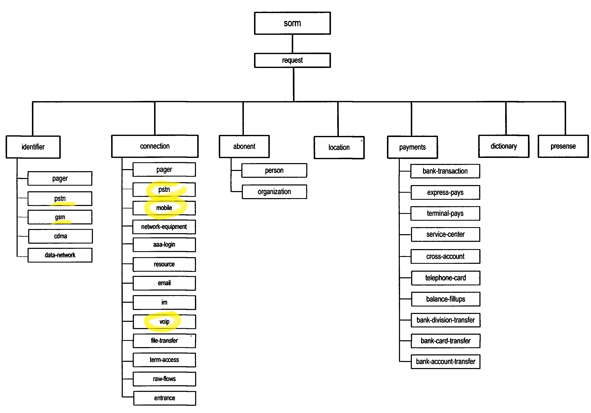

# sorm3

Приказ Минкомсвязи России от 29.10.2018 N 573 

Об утверждении Требований к техническим и программным средствам информационных систем, содержащих базы данных абонентов оператора связи и предоставленных им услугах связи, а также информацию о пользователях услугами связи и о предоставленных им услугах связи, обеспечивающих выполнение установленных действий при проведении оперативно-розыскных мероприятий 

(Зарегистрировано в Минюсте России 18.12.2018 N 53028)

- Содержимое приказа:
  <https://sudact.ru/law/prikaz-minkomsviazi-rossii-ot-29102018-n-573/>
- Содержимое приложения 9. 
  "Требования к параметрам кодирования протокола взаимодействия ASN.1 пункта управления и информационных систем, содержащих базы данных абонентов оператора связи и предоставленных им услугах связи, а также информацию о пользователях услугами связи и о предоставленных им услугах связи, обеспечивающих выполнение установленных действий при проведении оперативно-розыскных мероприятий" :
  <https://sudact.ru/law/prikaz-minkomsviazi-rossii-ot-29102018-n-573/prilozhenie/prilozhenie-n-9/>

## Анализ asn-файлов из приложения 9

В каталоге html приведена документация по asn-файлам полученная с помощью  [ASN1Doc](https://asn1.io/ASN1Doc/)

В качестве стартовой точки можно изучить файл [html/summary.html](html/summary.html) локально в рабочей копии
или на http://htmlpreview.github.io/?https://github.com/Sergey-Zorin/sorm3/blob/master/html/summary.html

Попробуем сопоставить asn-файлы из прил.9 со схемами из прил.8

### Схема 1

> 1. Структура модулей протокола взаимодействия ПУ и информационных систем, содержащих базы данных абонентов оператора связи и предоставленных им услугах связи, а также информацию о пользователях услугами связи и о предоставленных им услугах связи, обеспечивающих выполнение установленных действий при проведении оперативно-розыскных мероприятий (далее - ИС ОРМ) приведена на схеме 1.


В целом, схема соответствует содержимому файла [Sorm.asn](html/Sorm.asn.html) Прямоугольники на схеме соответствуют нескольким типам сообщений. Более подробно каждый тип описан в отдельном файле. 

:warning: тип filter не представлен на схеме и не описан ни в одном файле

| тип | описание | файл |
| ---- | ---- | ---- |
|  sessionMessage  |  сообщения организации сессии | [Sessions.asn](html/Sessions.asn.html) |
|  trapMessage    |  сообщения сигналов | [Traps.asn](html/Traps.asn.html) |
|  taskMessage    |  сообщения работы с задачами | [Tasks.asn](html/Tasks.asn.html) |
|  reportMessage  | сообщения работы с отчетами | [Reports.asn](html/Reports.asn.html) |
|  managementMessage | сообщения канала передачи мониторинга (КПМ) | [Management.asn](html/Management.asn.html) |
|  unformattedMessage | сообщения канала передачи неформатированных данных (КПНФ) | [Unformatted.asn](html/Unformatted.asn.html) |
|  filterMessage | сообщения установки/снятия фильтров записываемого содержимого соединений сети передачи данных | ??? |

Например,  в [Sessions.asn](html/Sessions.asn.html) описаны возможные запросы/ответы, и состав их полей:

```asn.1
sessionMessage   TAGGED ::= {
 OID {sorm-message-session} DATA CHOICE {
   connect              [0] ConnectRequest,     --- запрос на открытие сессии
   connect-response     [1] ConnectResponse,    --- ответ на запрос открытия сессии
   adjustment           [2] AdjustmentRequest,  --- согласование поддерживаемых типов со стороны ПУ
   adjustment-response  [3] AdjustmentResponse, --- ответ на запрос согласования данных
   disconnect           [4] DisconnectRequest,  --- запрос на закрытие сессии
   disconnect-response  [5] DisconnectResponse  --- ответ на запрос закрытия сессии
   }
}

--- запрос создания сессии
ConnectRequest ::=   SEQUENCE {
   session-timeout           INTEGER (60..2592000),   --- максимальное время неактивности
   max-data-length           INTEGER (10..100000),    --- максимальная длина блока отчета (в строках)
   data-packet-window-size   INTEGER (4..256),        --- окно канала передачи данных
...
}
...
```

В файле  [Classification.asn](html/Classification.asn.html) можно найти идентификаторы типов:
```
sorm-message-session     OID ::= "280"
sorm-message-trap        OID ::= "281"
sorm-message-task        OID ::= "282"
sorm-message-report      OID ::= "283"
sorm-message-management  OID ::= "284"
sorm-message-unformatted OID ::= "285"
sorm-message-filter      OID ::= "286"
```

### Схема 2

> 2. Структура разделения поисковых критериев кпд1 представлена на схеме 2.



В файле  [Classification.asn](html/Classification.asn.html) можно найти соответствующие идентификаторы:
```
sorm-request-identifier-pager OID ::= "140"
sorm-request-identifier-pstn OID ::= "141"
sorm-request-identifier-gsm OID ::= "142"
sorm-request-identifier-cdma OID ::= "143"
sorm-request-identifier-data-network OID ::= "144"
sorm-request-identifier-voip OID ::= "145"
sorm-request-connection-pager OID ::= "160"
sorm-request-connection-pstn OID ::= "161"
sorm-request-connection-mobile OID ::= "162"
sorm-request-connection-aaa-login OID ::= "164"
sorm-request-connection-resource OID ::= "165"
sorm-request-connection-email OID ::= "166"
sorm-request-connection-im OID ::= "167"
sorm-request-connection-voip OID ::= "168"
sorm-request-connection-file-transfer OID ::= "169"
sorm-request-connection-term-access OID ::= "170"
sorm-request-connection-raw-flows OID ::= "171"
sorm-request-connection-entrance OID ::= "172"
sorm-request-connection-address-translations OID ::= "173"
sorm-request-abonent-person OID ::= "180"
sorm-request-abonent-organization OID ::= "181"
sorm-request-location OID ::= "200"
sorm-request-payment-bank-transaction OID ::= "220"
sorm-request-payment-express-pays OID ::= "221"
sorm-request-payment-terminal-pays OID ::= "222"
sorm-request-payment-service-center OID ::= "223"
sorm-request-payment-cross-account OID ::= "224"
sorm-request-payment-telephone-card OID ::= "225"
sorm-request-payment-balance-fillups OID ::= "226"
sorm-request-payment-bank-division-transfer OID ::= "227"
sorm-request-payment-bank-card-transfer OID ::= "228"
sorm-request-payment-bank-account-transfer OID ::= "229"
sorm-request-dictionaries OID ::= "240"
sorm-request-presense OID ::= "260"
```

Наименования файлов идет как-то в разнобой (что настораживает)

| идентификаторы  | файл |
| ---- | ---- |
| sorm-request-identifier-*  | [RequestedIdentifiers.asn](html/RequestedIdentifiers.asn.html) |
| sorm-request-connection-*  | [RequestedConnections.asn](html/RequestedConnections.asn.html) |
| sorm-request-abonent-*  | [RequestedAbonents.asn](html/RequestedAbonents.asn.html) |
| sorm-request-location  | ???? |
| sorm-request-payment-*  | [TasksPayments.asn](html/TasksPayments.asn.html) |
| sorm-request-dictionaries  | [Dictionaries.asn](html/Dictionaries.asn.html) |
| sorm-request-presense  | [TasksPresense.asn](html/TasksPresense.asn.html) |

### Схема 3

> 3. Структура разделения видов отчетов кпд2 представлена на схеме 3.


### Схема 4

> Структура разделения модулей протокола взаимодействия ПУ и ИС ОРМ приведена на схеме 4.

(Это почти дословное повторение описания к схеме 1)


## Сценарий запроса

Пульт управления (ПУ) общается с информационной системой ОРМ (ИС ОРМ) путем обмена сообщениями.


Типичный сценарий получения данных ПУ от ИС ОРМ состоит из следующих стадий

1. ПУ отправляет на ИС ОРМ по кпд1 запрос на создания задания (Create Task)
2. ИС ОРМ принимает задание к исполнению, присваевает ему ID (уникальный в рамках ИС), и отправляет этот ID в ответе по кпд1 
   (ПУ может отправить несколько заданий не дожидаясь исполнения предыдущих)
3. Спустя какое-то время ПУ отправляет на ИС ОРМ по кпд1 запрос на список заданий с готовыми к выгрузке результатами (Data Ready)
4. ИС ОРМ отправляет в ответе по кпд1 список ID готовых заданий
5. ПУ отправляет на ИС ОРМ по кпд1 запрос на загрузку результатов  задания с указанным ID (Data Load)
6. ИС ОРМ начинает передавать по кпд2 (или кпд5) блоки данных с результатами (Data Content Report). Блоков может быть несколько или ни одного.
7. ПУ подтверждает получение каждого блока, отправляя на ИС ОРМ подтверждение (Acknolegement) по кпд2
8. После отправки всех блоков с данными ИС ОРМ посылает на ПУ по кпд1 ответ на запрос (Data Load)  

Использование кпд2 или кпд5 определено в прил.2 пункт 25:

- кпд5 используется при "получении сообщений пользователя", т.е. при передаче записи голоса в случае телефонии (тфоп, сотовой или voip)
- кпд2 используется во всех остальных случаях 


## Типичный сценарий получения данных телефонного звонка

В общем виде получение данных телефонного звонка происходит в два этапа 

1. Формируется запрос (task) на поиск соединений (звонков) по заданным критериям [ConnectionsTask](./html/TasksConnections.asn.html#I2111).
   В результате приходит список соединений, в котором для каждого соединения наряду с прочими параметрами указан уникальный идентификатор **data-content-id**
2. Формируется запрос (task) "получения содержимого потоков" [DataContentTask](./html/TasksContentTask.asn.html#I2123) с указанием конкретного идентификатора **data-content-id**

Критерии поиска, параметры соединений и голосовые данные для тфоп, сотовой связи и voip несколько различаются. В следующих трех пунктах каждый случай будет разобран отдельно.

На схемах 2 и 3 элементы, относящиеся к телефонным звонкам, выделены желтым.

### Звонки ТфОП

В запросе [ConnectionsTask](./html/TasksConnections.asn.html#I2111) могут быть указаны один или несколько критериев [requestedConnectionPstn](./html/RequestedConnections.asn.html#I1785)

```asn.1
--- параметры соединений абонента ТФОП
requestedConnectionPstn                 TAGGED ::= {
  OID {sorm-request-connection-pstn} DATA CHOICE {
    duration              [0] INTEGER (0..86399),                 --- время соединения
    call-type-id          [1] INTEGER (0..4294967295),            --- тип соединения
    in-abonent-type       [2] PhoneAbonentType,                   --- тип вызывающего абонента
    out-abonent-type      [3] PhoneAbonentType,                   --- тип вызываемого абонента
    switch-id             [4] UTF8String (SIZE (1..128)),         --- код коммутатора обслужившего вызов
    inbound-bunch         [5] INTEGER (0..4294967295),            --- входящий пучок
    outbound-bunch        [6] INTEGER (0..4294967295),            --- исходящий пучок
    border-switch-id      [7] UTF8String (SIZE (1..128)),         --- код пограничного коммутатора
    term-cause            [8] INTEGER (0..16384),                 --- причина завершения соединения
    supplement-service-id [9] INTEGER (0..4294967295),            --- ДВО при соединении
    phone-card-number     [10] NumericString (SIZE (1..20)),      --- номер телефонной карты
    in-info               [11] RequestedConnectionPstnIdentifier, --- идентификаторы вызывающего абонента
    out-info              [12] RequestedConnectionPstnIdentifier, --- идентификаторы вызываемого абонента
    forwarding-identifier [13] UTF8String (SIZE (2..32)),         --- телефонный номер при переадресации
    message               [20] UTF8String                         --- текстовое содержание сообщения абонента
  }
}
```

В отчете [ConnectionsReport](./html/ReportsConnections.asn.html#I937), по кпд2 приходит список соединений со следующими данными [pstnRecord](./html/ReportsConnections.asn.html#I1119):

``` asn.1
-- Детализированные записи звонков абонентов ТФОП, в т.ч. и неудавшиеся попытки соединений
pstnRecord                              TAGGED ::= {OID {sorm-report-connection-pstn} DATA SEQUENCE OF
                                             PstnRecordContent}

 

PstnRecordContent ::=                   SEQUENCE {
   telco-id                                TelcoID,     --- идентификатор оператора связи или структурного подразделения
   begin-connection-time                   DateAndTime,                               --- дата и время начала соединения
   duration                                INTEGER (0..86399),                          --- время соединения
   call-type-id                            INTEGER (0..4294967295),                     --- тип соединения
   supplement-service-id                   INTEGER (0..4294967295),                     --- ДВО при соединении
   in-abonent-type                         PhoneAbonentType,                            --- тип вызывающего абонента
   out-abonent-type                        PhoneAbonentType,                            --- тип вызываемого абонента
   switch-id                               UTF8String (SIZE (1..128)),       --- код коммутатора обслужившего соединение
   inbound-bunch                           INTEGER (0..4294967295),                     --- входящий пучок
   outbound-bunch                          INTEGER (0..4294967295),                     --- исходящий пучок
   term-cause                              INTEGER (0..16384),                         --- причина завершения соединения
   phone-card-number                       [0] NumericString (SIZE (1..20))        OPTIONAL, --- номер телефонной карты
   in-info                                 [1] ReportedIdentifier                  OPTIONAL,
                                                                                 --- идентификаторы вызывающего абонента
   dialed-digits                           [2] UTF8String (SIZE (1..128)),      --- набранный номер вызываемого абонента
   out-info                                [3] ReportedIdentifier                  OPTIONAL,
                                                                                 --- идентификаторы вызываемого абонента
   forwarding-identifier                   [4] UTF8String (SIZE (2..32))           OPTIONAL,
                                                                                  --- телефонный номер при переадресации
   border-switch-id                        [5] UTF8String (SIZE (1..128))          OPTIONAL,
                                                                                        --- код пограничного коммутатора
   message                                 [10] UTF8String                         OPTIONAL,
                                                                             --- текстовое содержание сообщения абонента
   ss7-opc                                 [11] UTF8String (SIZE (1..32))          OPTIONAL,
                                                                                           --- SS7 код точки отправления
   ss7-dpc                                 [12] UTF8String (SIZE (1..32))          OPTIONAL,
                                                                                            --- SS7 код точки назначения
   data-content-id                         [13] DataContentID                      OPTIONAL  --- идентификатор потока
}
```

Запись голоса приходит по кпд5 в отчете [DataContentReport](./html/ReportsDataContent.asn.html#I955)

``` asn.1
reportDataContentRaw                    TAGGED ::= {OID {sorm-report-data-content-raw} DATA SEQUENCE OF
                                             RawRecordContent}
 

RawRecordContent ::=                    SEQUENCE {
   successful                              BOOLEAN,                      --- признак успешного формирования блока данных
   data                                    [0] OCTET STRING (SIZE (1..1048576))    OPTIONAL,
                                                           --- содержимое блока (в случае если блок успешно сформирован)
   error                                   [1] UTF8String (SIZE (1..4096))         OPTIONAL,
                                                        --- описание ошибки (в случае если не удалось сформировать блок)
   codec-info                              [2] UTF8String (SIZE (1..4096))         OPTIONAL,
                                                  --- описание способа кодирования в формате SDP в соответствии RFC 2327
   direction                               [3] DataContentRawDirection             OPTIONAL, --- направление передачи
   channel                                 [4] INTEGER                             OPTIONAL  --- канал
}


DataContentRawDirection ::=             ENUMERATED {client-server (0), server-client (1)}
```


### Звонки voip

В запросе [ConnectionsTask](./html/TasksConnections.asn.html#I2111) могут быть указаны один или несколько критериев [requestedVoip](./html/RequestedConnections.asn.html#I1792)

``` asn.1
requestedVoip                           TAGGED ::= {
   OID {sorm-request-connection-voip} DATA CHOICE {
      point-id                                [0] INTEGER (0..1000),
                                   --- идентификатор точки подключения к сети передачи данных, с которой получены записи
      client-info                             [1] NetworkPeerInfo,       --- идентификатор абонента сети передачи данных
      server-info                             [2] NetworkPeerInfo,        --- идентификатор сервера сети передачи данных
      duration                                [3] INTEGER (0..864000),                --- длительность разговора, сек.
      originator-name                         [4] UTF8String (SIZE (1..512)),     --- общедоступное имя инициатора связи
      call-type-id                            [5] INTEGER (0..4294967295),            --- способ подключения
      voip-calling-number                     [6] DataVoipNumber,                     --- номер вызывающего абонента
      voip-called-number                      [7] DataVoipNumber,                     --- номер вызываемого абонента
      inbound-bunch                           [8] Bunch,                              --- входящий пучок
      outbound-bunch                          [9] Bunch,                              --- исходящий пучок
      conference-id                           [10] UTF8String (SIZE (1..64)),         ---  идентификатор конференции
      protocol                                [11] VoipProtocol,
      term-cause                              [12] INTEGER (0..16384),                --- причина завершения соединения
      abonent-id                              [13] UTF8String (SIZE (0..64)),
      nat-info                                [20] NetworkPeerInfo,                   --- транслированные NAT IP/порт
      location                                [21] Location                           --- местоположение абонента
   }
}
```

В отчете [ConnectionsReport](./html/ReportsConnections.asn.html#I937), приходит список соединений со следующими данными [dataVoipRecord](./html/ReportsConnections.asn.html#I1128):

``` asn.1
DataVoipRecordContent ::=               SEQUENCE {
   voip-cdr-header                         DataNetworkCdrHeader,                        --- заголовок CDR-соединения
   voip-session-id                         UTF8String (SIZE (0..64)),                   --- идентификатор сессии/call-id
   voip-conference-id                      UTF8String (SIZE (1..64)),                   --- идентификатор конференции
   voip-duration                           INTEGER (0..864000),                         --- длительность разговора, сек.
   voip-originator-name                    UTF8String (SIZE (1..512)),            --- общедоступное имя инициатора связи
   voip-call-type-id                       INTEGER (0..4294967295),                     --- способ подключения
   voip-calling-number                     DataVoipNumber,                              --- номер вызывающего абонента
   voip-called-number                      DataVoipNumber,                              --- номер вызываемого абонента
   voip-in-bytes-count                     INTEGER (0..18446744073709551615),
                            --- объем переданных данных (включает как соединения управления так и передачи данных), байт
   voip-out-bytes-count                    INTEGER (0..18446744073709551615),
                              --- объем принятых данных (включает как соединения управления так и передачи данных), байт
   voip-fax                                BOOLEAN,                 --- была попытка передачи факсовой информации (T.38)
   voip-term-cause                         INTEGER (0..16384),                         --- причина завершения соединения
   inbound-bunch                           [0] Bunch                               OPTIONAL, --- входящий пучок
   outbound-bunch                          [1] Bunch                               OPTIONAL, --- исходящий пучок
   voip-gateways                           [2] SEQUENCE OF IPAddress               OPTIONAL,
                                                                  --- идентификаторы медиашлюзов, обслуживших соединение
   voip-protocol                           [3] VoipProtocol                        OPTIONAL,
   supplement-service-id                   [4] INTEGER (0..4294967295)             OPTIONAL, --- ДВО при соединении
   voip-abonent-id                         [5] UTF8String (SIZE (0..64))           OPTIONAL, --- идентификатор абонента
   voip-nat-info                           [10] SEQUENCE OF NetworkPeerInfo        OPTIONAL,
                                                                                         --- транслированные NAT IP/порт
   voip-location                           [11] Location                           OPTIONAL, --- местоположение абонента
   voip-event                              [12] VoIPEvent                          OPTIONAL, --- тип события
   voip-data-content-id                    [13] DataContentID                      OPTIONAL  --- идентификатор потока
}
```

Запись голоса приходит по кпд5 в отчете [DataContentReport](./html/ReportsDataContent.asn.html#I955) в том же виде как и для ТфОП

### Сотовые звонки

В запросе [ConnectionsTask](./html/TasksConnections.asn.html#I2111) могут быть указаны один или несколько критериев [requestedConnectionMobile](./html/RequestedConnections.asn.html#I1786)

```asn.1
requestedConnectionMobile               TAGGED ::= {
   OID {sorm-request-connection-mobile} DATA CHOICE {
      duration                                [0] INTEGER (0..86399),                 --- время соединения
      call-type-id                            [1] INTEGER (0..4294967295),            --- тип соединения
      supplement-service-id                   [2] INTEGER (0..4294967295),            --- ДВО при соединении
      in-abonent-type                         [3] PhoneAbonentType,                   --- тип вызывающего абонента
      out-abonent-type                        [4] PhoneAbonentType,                   --- тип вызываемого абонента
      switch-id                               [5] UTF8String (SIZE (1..128)),
                                                                             --- код коммутатора обслужившего соединения
                                                                             --- или номер SMS центра если SMS
      inbound-bunch                           [6] Bunch,                              --- входящий пучок
      outbound-bunch                          [7] Bunch,                              --- исходящий пучок
      border-switch-id                        [8] UTF8String (SIZE (1..128)),         --- код пограничного коммутатора
      roaming-partner-id                      [9] INTEGER (0..4294967295),            --- код роумингового партнера
      term-cause                              [10] INTEGER (0..16384),                --- причина завершения соединения
      in-info                                 [11] RequestedConnectionMobileIdentifier,
                                                                                 --- идентификаторы вызывающего абонента
      in-end-location                         [12] Location,     --- местоположение вызывающего абонента на конец вызова
      in-begin-location                       [13] Location,    --- местоположение вызывающего абонента на начало вызова
      dialed-digits                           [14] UTF8String (SIZE (1..128)),  --- набранный номер вызываемого абонента
      out-info                                [15] RequestedConnectionMobileIdentifier,
                                                                                 --- идентификаторы вызываемого абонента
      out-begin-location                      [16] Location,    --- местоположение вызываемого абонента на начало вызова
      out-end-location                        [17] Location,     --- местоположение вызываемого абонента на конец вызова
      forwarding-identifier                   [18] UTF8String (SIZE (2..32)),     --- телефонный номер при переадресации
      message                                 [40] UTF8String                --- текстовое содержание сообщения абонента
   }
}
```

В отчете [ConnectionsReport](./html/ReportsConnections.asn.html#I937), приходит список соединений со следующими данными [mobileRecord](./html/ReportsConnections.asn.html#I1120):

```asn.1
-- Детализированные записи звонков мобильных абонентов, в т.ч. и неудавшиеся попытки соединений
-- Должны содержать также записи об SMS, в т.ч. и неудавшиеся попытки отправки
mobileRecord                            TAGGED ::= {OID {sorm-report-connection-mobile} DATA SEQUENCE OF
                                             MobileRecordContent}
 
MobileRecordContent ::=                 SEQUENCE {
   telco-id                                TelcoID,     --- идентификатор оператора связи или структурного подразделения
   begin-connection-time                   DateAndTime,                               --- дата и время начала соединения
   duration                                INTEGER (0..86399),                          --- время соединения
   call-type-id                            INTEGER (0..4294967295),                     --- тип соединения
   supplement-service-id                   INTEGER (0..4294967295),                     --- ДВО при соединении
   in-abonent-type                         PhoneAbonentType,                            --- тип вызывающего абонента
   out-abonent-type                        PhoneAbonentType,                            --- тип вызываемого абонента
   switch-id                               UTF8String (SIZE (1..128)),       --- код коммутатора обслужившего соединении
   term-cause                              INTEGER (0..16384),                         --- причина завершения соединения
   inbound-bunch                           [0] Bunch                               OPTIONAL, --- входящий пучок
   outbound-bunch                          [1] Bunch                               OPTIONAL, --- исходящий пучок
   in-info                                 [2] ReportedIdentifier                  OPTIONAL,
                                                                                 --- идентификаторы вызывающего абонента
   in-end-location                         [3] Location                            OPTIONAL,
                                                                 --- местоположение вызывающего абонента на конец вызова
   in-begin-location                       [4] Location                            OPTIONAL,
                                                                --- местоположение вызывающего абонента на начало вызова
   out-info                                [5] ReportedIdentifier                  OPTIONAL,
                                                                                 --- идентификаторы вызываемого абонента
   out-begin-location                      [6] Location                            OPTIONAL,
                                                                --- местоположение вызываемого абонента на начало вызова
   out-end-location                        [7] Location                            OPTIONAL,
                                                                 --- местоположение вызываемого абонента на конец вызова
   forwarding-identifier                   [8] UTF8String (SIZE (2..32))           OPTIONAL,
                                                                                  --- телефонный номер при переадресации
   roaming-partner-id                      [9] INTEGER (0..4294967295)             OPTIONAL,
                                                                                           --- код роумингового партнера
   border-switch-id                        [10] UTF8String (SIZE (1..128))         OPTIONAL,
                                                                                        --- код пограничного коммутатора
   message                                 [40] UTF8String                         OPTIONAL,
                                                                             --- текстовое содержание сообщения абонента
   data-content-id                         [41] DataContentID                      OPTIONAL  --- идентификатор потока
}
```

Запись голоса приходит по кпд5 в отчете [DataContentReport](./html/ReportsDataContent.asn.html#I955) в том же виде как и для ТфОП


### Ресурсы

- <https://asn1.io/>
  - [ASN1 Playground](https://asn1.io/asn1playground/)
  - [ASN1Doc](https://asn1.io/ASN1Doc/)
